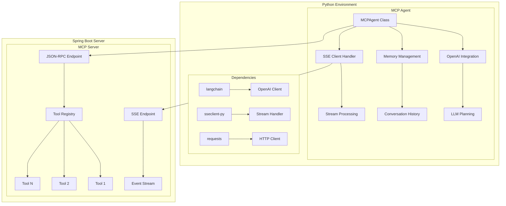
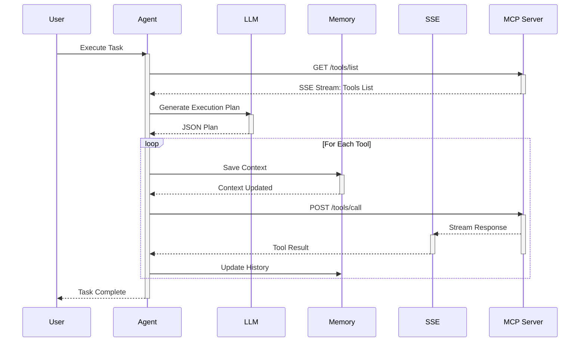
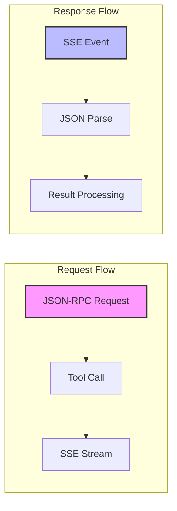
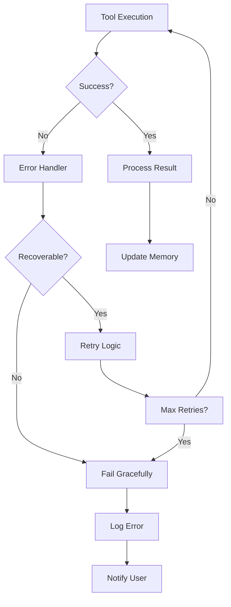
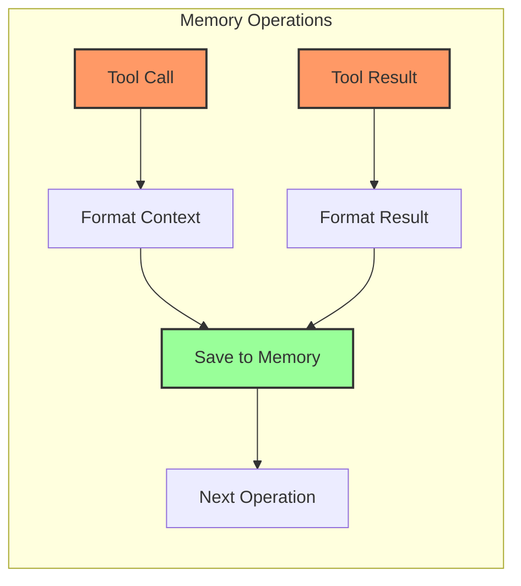

# MCP Agent System Architecture

## Complete System Overview



## Detailed Communication Flow



## Data Flow with JSON Examples



### Example JSON Flows

```json
// Tool Listing Request
{
    "jsonrpc": "2.0",
    "method": "tools/list",
    "id": "req-123",
    "params": {}
}

// Tool Call Request
{
    "jsonrpc": "2.0",
    "method": "tools/call",
    "id": "req-456",
    "params": {
        "name": "createClient",
        "arguments": {
            "name": "Alice",
            "address": "123 Main St"
        }
    }
}

// SSE Response
data: {
    "jsonrpc": "2.0",
    "id": "req-456",
    "result": {
        "status": "success",
        "clientId": "CL12345"
    }
}
```

## Error Handling and Recovery



## Memory Management Flow

