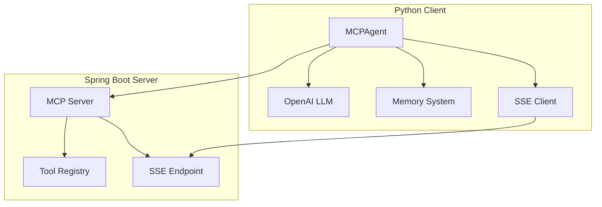
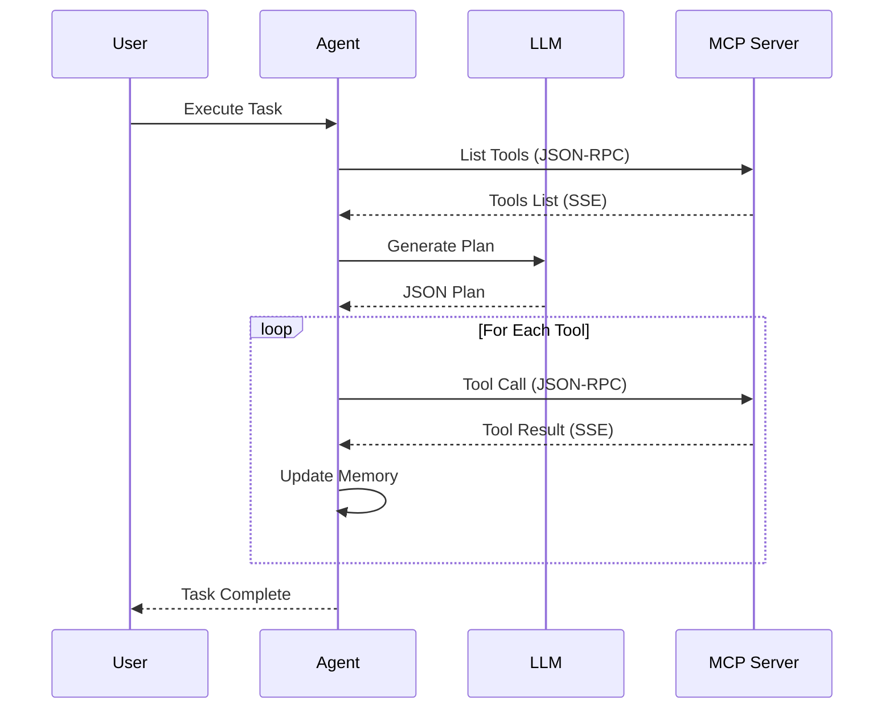
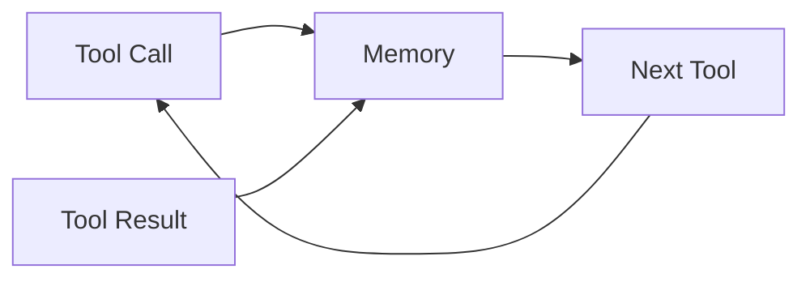
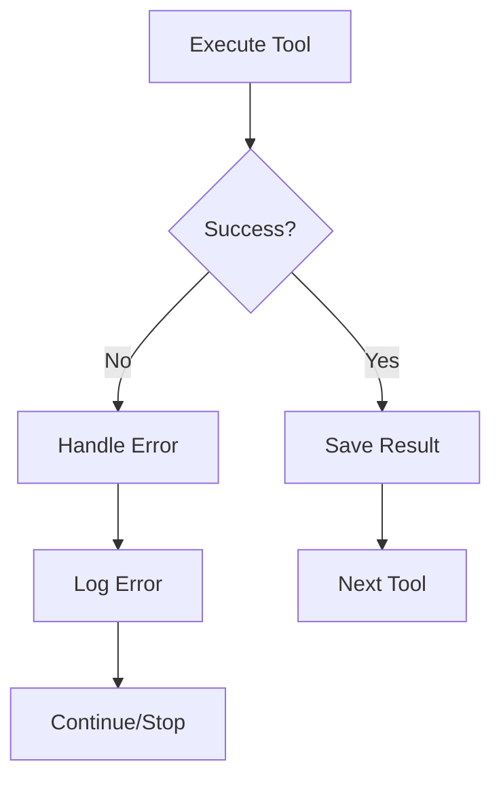

# MCP Agent System Flow

## System Architecture



## Detailed Flow



## Data Flow Example

### Tool Listing
```mermaid
sequenceDiagram
    participant Agent
    participant MCP Server

    Agent->>MCP Server: {
        "jsonrpc": "2.0",
        "method": "tools/list",
        "id": "uuid",
        "params": {}
    }
    MCP Server-->>Agent: {
        "result": {
            "tools": [
                {"name": "tool1", "description": "desc1"},
                {"name": "tool2", "description": "desc2"}
            ]
        }
    }
```

### Tool Execution
```mermaid
sequenceDiagram
    participant Agent
    participant MCP Server

    Agent->>MCP Server: {
        "jsonrpc": "2.0",
        "method": "tools/call",
        "id": "uuid",
        "params": {
            "name": "toolName",
            "arguments": {...}
        }
    }
    MCP Server-->>Agent: {
        "result": {
            "status": "success",
            "data": {...}
        }
    }
```

## Memory Flow



## Error Handling Flow



## Component Details

### MCPAgent
- Handles communication with MCP Server
- Manages tool execution flow
- Maintains conversation memory
- Coordinates with LLM for planning

### OpenAI LLM
- Generates execution plans
- Validates tool usage
- Ensures proper JSON formatting

### Memory System
- Stores tool execution history
- Maintains conversation context
- Supports future planning

### SSE Client
- Handles server-sent events
- Manages streaming responses
- Parses JSON-RPC messages

### MCP Server
- Exposes tool registry
- Handles JSON-RPC requests
- Streams responses via SSE
- Manages tool execution 